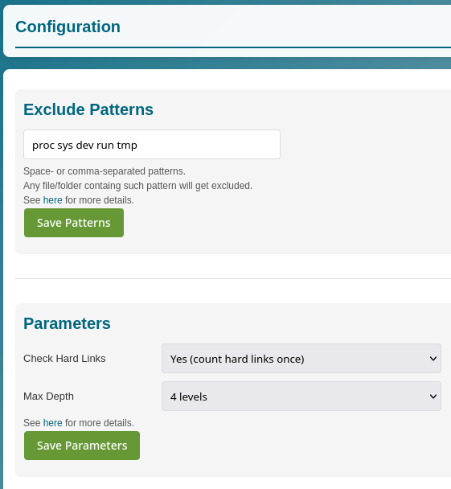
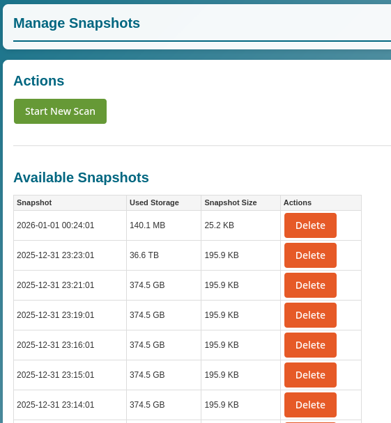

# Storage Analyzer
[](https://hub.docker.com/r/caco3x/storage-analyzer/)
[](https://hub.docker.com/r/caco3x/storage-analyzer/)
[](https://hub.docker.com/r/caco3x/storage-analyzer/)

This tool uses [Duc](https://duc.zevv.nl/) to provide a comprehensive Storage Analyzer similar to [Synology's Storage Analyzer](https://www.synology.com/en-us/dsm/packages/StorageAnalyzer). It offers advanced storage usage analysis with an intuitive web interface, designed primarily for NAS systems but compatible with any Docker-enabled system. Features include visual sunburst charts, historical snapshot comparisons, flexible scheduling, and granular configuration options for efficient storage monitoring and management.


 

The built docker images can be found on [Docker Hub](https://hub.docker.com/r/caco3x/storage-analyzer/).

# Features
- **Automated Scanning**: Built-in cron-based scheduling for automatic storage scans (hourly, daily, weekly, monthly)
- **Interactive Web Interface**: Modern, responsive UI for browsing storage usage with visual feedback
- **Visual Storage Analysis**: Color-coded directory listings and interactive sunburst charts for intuitive data visualization
- **Snapshot Management**: Create, view, compare, and delete multiple storage snapshots over time
- **Flexible Configuration**: 
  - Customizable exclude patterns to skip unwanted files/directories
  - Configurable scan parameters (hard link handling, max depth levels)
  - Persistent configuration across container restarts
- **Manual Control**: On-demand manual scans
- **Multi-Directory Support**: Scan entire filesystem or specific directories resp. volumes
- **Docker Integration**: Single-command deployment with Docker Compose or standalone Docker
- **Real-time Logging**: View scan logs and system status through the web interface
- **Enhanced UI Features**: Modal dialogs, status notifications, and responsive design

## Usage Examples
### With Docker Compose
See [docker-compose.yml](docker-compose.yml).

Run it with 
```
docker compose up --build --detach
```

This compose file also mounts a persistent volume to `/config` so settings (e.g. the scan parameters) survive container rebuild/removal.
And the `/snapshots` volume is mounted to persist the snapshots.

### Without Docker Compose
```
docker run \
    -p 80:80 \
    --mount type=bind,src=/,dst=/scan,readonly \
    --mount type=volume,src=snapshots,dst=/snapshots \
    --mount type=volume,src=config,dst=/config \
    caco3x/storage-analyzer
```

If you don't want to scan the ehole root but just some subfolders, use
```
docker run \
    -p 80:80 \
    --mount type=bind,src=/volume1,dst=/scan/volume1,readonly \
    --mount type=bind,src=/volume2,dst=/scan/volume2,readonly \
    --mount type=volume,src=snapshots,dst=/snapshots \
    --mount type=volume,src=config,dst=/config \
    caco3x/storage-analyzer
```

## Persistent Volumes
 - ### /config
   **Configuration persistence** - Mount this volume to preserve all settings across container restarts and updates.
   
   **Persisted settings:**
   - `/config/schedule` - Cron-based scan schedule (hourly/daily/weekly/monthly)
   - `/config/exclude` - File/folder exclusion patterns for targeted scanning
   - `/config/duc-params` - Advanced Duc scanning parameters and options

 - ### /snapshots
   **Historical data storage** - Mount this volume to maintain storage snapshots and analysis data over time.
   
   **Features:**
   - Zstandard compression for efficient storage utilization
   - Timestamped snapshots for historical comparison
   - Cross-snapshot analysis and trend identification

 - ### /scan
   **Target directory mapping** - This is the source directory that [DUC](https://duc.zevv.nl/) analyzes for storage usage.
   
   **Configuration options:**
   - **Full system scan**: Mount root `/` to `/scan` for complete filesystem analysis
   - **Selective scanning**: Mount specific directories (e.g., `/volume1`, `/volume2`) to `/scan/volume1`, `/scan/volume2` for targeted analysis
   - **Read-only mounting**: Recommended for security and data integrity

## Development
```bash
sudo docker run -it -p 8080:80 --mount type=bind,src=$PWD,dst=/scan,readonly -v $PWD/snapshots:/snapshots -v $PWD/app:/var/www/html --name storage-analyzer $(docker build -q .)
sudo docker stop storage-analyzer; sudo docker rm storage-analyzer
```

Now you can edit the files in the `app` folder without having to rebuild/start the docker container.

### Upload to dockerhub
Build, tag and publish:
```
docker buildx build . --file Dockerfile --tag caco3x/storage-analyzer:latest --load

sudo docker login -u caco3x
sudo docker push caco3x/storage-analyzer:latest
```

## References
- DUC homepage: https://duc.zevv.nl/

## Support

If you find this project useful, please consider supporting it by giving it a star on [GitHub](https://github.com/caco3x/storage-analyzer).

If you find an issue, please open an issue on [GitHub](https://github.com/caco3x/storage-analyzer/issues).

## Similar Projects
- https://github.com/MaximilianKoestler/duc-service
- https://hub.docker.com/r/tigerdockermediocore/duc-docker
- https://hub.docker.com/r/digitalman2112/duc
