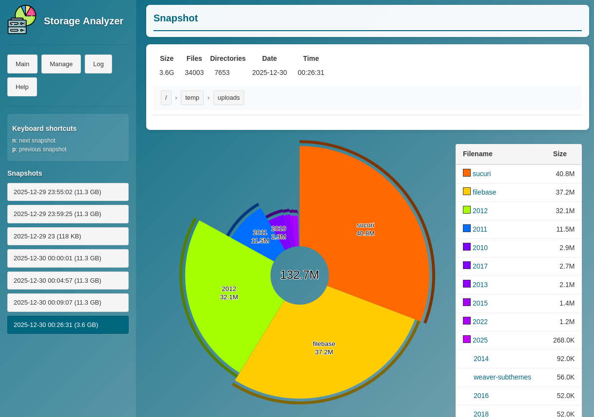

# Storage Analyzer
[](https://hub.docker.com/r/caco3x/storage-analyzer/)
[](https://hub.docker.com/r/caco3x/storage-analyzer/)
[](https://hub.docker.com/r/caco3x/storage-analyzer/)

This tool uses [Duc](https://duc.zevv.nl/) to provide a generic Storage Analyzer like provided by [Synology](https://www.synology.com/en-us/dsm/packages/StorageAnalyzer) to analyze the storage usage of a system. It's main goal is to to provide a storage usage overview on a NAS, how ever it could also work on any system which provides docker.



The built docker images can be found on [Docker Hub](https://hub.docker.com/r/caco3x/storage-analyzer/).

# Features
- Included scheduling for automatic scanning
- Single-command deployment
- Very small image footprint
- Web UI to view and manage the snapshots
- Easy navigation through directories and snapshots
- Manual scan trigger
- Log output of the last scan

## Usage Examples
### With Docker Compose
Use [docker-compose.yml](docker-compose.yml).

Run it with 
```
docker compose up --build --detach
```

This compose file also mounts a persistent volume to `/config` so settings (e.g. the scan schedule configured in the management page) survive container rebuild/removal.

### Without Docker Compose
```
docker run -e "SCHEDULE=0 0 * * *" -e "RUN_SCAN_ON_STARTUP=false" \
    -e "EXCLUDE=proc sys dev run tmp usr proc" -p 80:80 \
    --mount type=bind,src=/,dst=/scan/root,readonly \
    --mount type=volume,src=duc_database,dst=/database \
    --mount type=volume,src=duc_config,dst=/config \
    caco3x/storage-analyzer
```

## Parameters
 - ### SCHEDULE
   A cron-expression that determines when an automatic scan is started.

 - ### RUN_SCAN_ON_STARTUP
   Set to true if a snapshot should be created on each docker container start

 - ### EXCLUDE
   Folder/file patterns to be excluded (comma separated list without double quotes).

   Example: `proc sys dev run tmp temp usr proc`

 - ### /config (volume)
   Persisted configuration directory. Mount this path to keep settings (e.g. scan schedule) across container rebuild/removal.

## Web Endpoints
- `/duc.cgi` provides a web gui to explore the disk usage
- `/manual_scan.cgi` queues a manual scan
- `/log.cgi` displays the log output from the last scan

## Developing
```bash
sudo docker run -it -e "RUN_SCAN_ON_STARTUP=true" -e "EXCLUDE=proc sys dev run tmp usr proc" -p 8080:80 --mount type=bind,src=$PWD/..,dst=/scan/temp,readonly -v $PWD/duc_database:/database -v $PWD/app:/var/www/html --name storage-analyzer $(docker build -q .)
sudo docker stop storage-analyzer; sudo docker rm storage-analyzer
```

Now you can edit the files in the `app` folder without having to rebuild/start the docker container.

### Upload to dockerhub
Build, tag and publish:
```
docker buildx build . --file Dockerfile --tag caco3x/storage-analyzer:latest --load

sudo docker login -u caco3x
sudo docker push caco3x/storage-analyzer:latest
```

## References
- Duc homepage: https://duc.zevv.nl/

## Similar Projects
- https://github.com/MaximilianKoestler/duc-service
- https://hub.docker.com/r/tigerdockermediocore/duc-docker
- https://hub.docker.com/r/digitalman2112/duc
